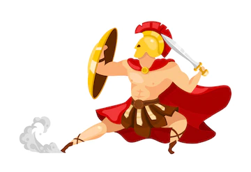

## Θησέας

Ο Θησέας είναι μια εφαρμογή που θα διευκολύνει και θα επιταχύνει τη διαδικασία ανάθεσης, ολοκλήρωσης και βαθμολόγησης των διπλωματικών εργασιών στο Εθνικό Μετσόβιο Πολυτεχνείο.

### Πώς λειτουργεί;

Αρχικά ο χρήστης κάνει log in στην εφαρμογή.
Ανάλογα με το ρόλο του ( φοιτητής, καθηγητής, γραμματεία ) γίνεται redirect σε διαφορετικό μενού.

#### Καθηγητής:

* Ο καθηγητής βλέπει όλες τις διπλωματικές εργασίες που είναι υπεύθυνος. Μπορεί να τις φιλτράρει ανάλογα με την κατάσταση που βρίσκονται.
1. Done = Έχουν ολοκληρωθεί.
2. Doing = Διεκπεραιώνονται αυτή τη στιγμή.
3. Pending = Έχουν δημοσιευτεί από τον καθηγητή, αλλά δεν έχει βρεθεί ακόμα φοιτητής να τις αναλάβει

Επίσης ο καθηγητής μπορεί να πατήσει το κουμπί "Δημιουργία Νέας Διπλωματικής" και να δημιουργήσει μια καινούργια διπλωματική εργασία.

* Στην δεύτερη καρτέλα του μενού "Αιτήματα", ο καθηγητής βλέπει τα αιτήματα των φοιτητών για τις διπλωματικές εργασίες που έχει δημοσιεύσει στον Θησέα.

* Αν ο καθηγητής είναι ταυτόχρονα και υπεύθυνος τομέα, τότε θα του εμφανίζεται στο μενού και μια τρίτη επιλογή που ονομάζεται "Εγκρίσεις"
Σε αυτήν την καρτέλα, ο εκάστοτε καθηγητής θα εγκρίνει τις αναθέσεις των διπλωματικών εργασιών.

#### Φοιτητής:

#### Γραμματεία:

